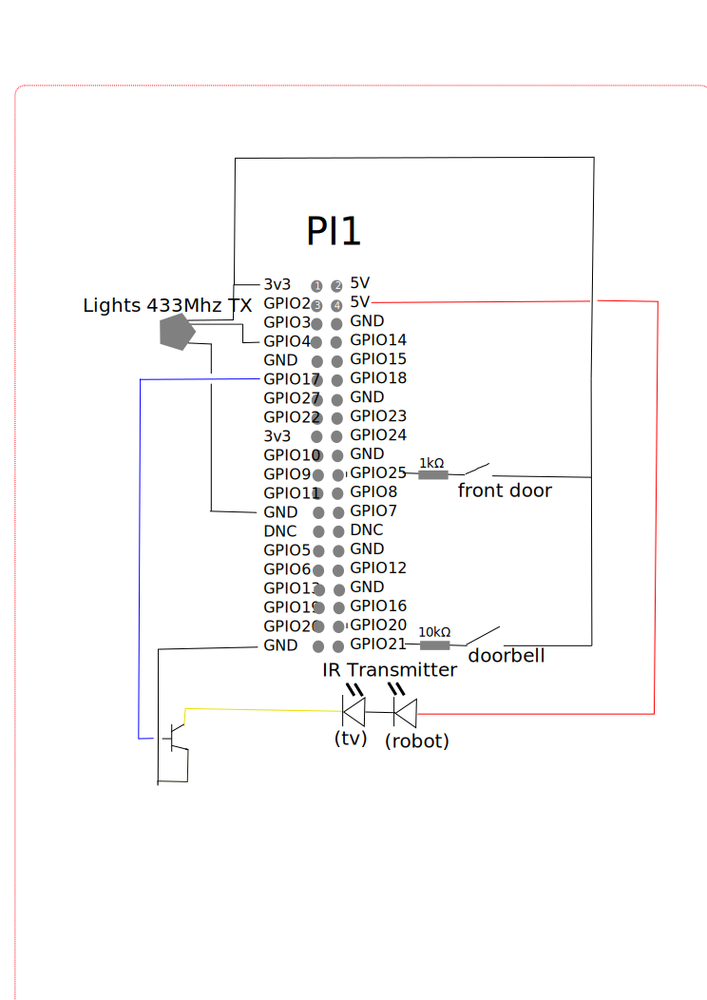
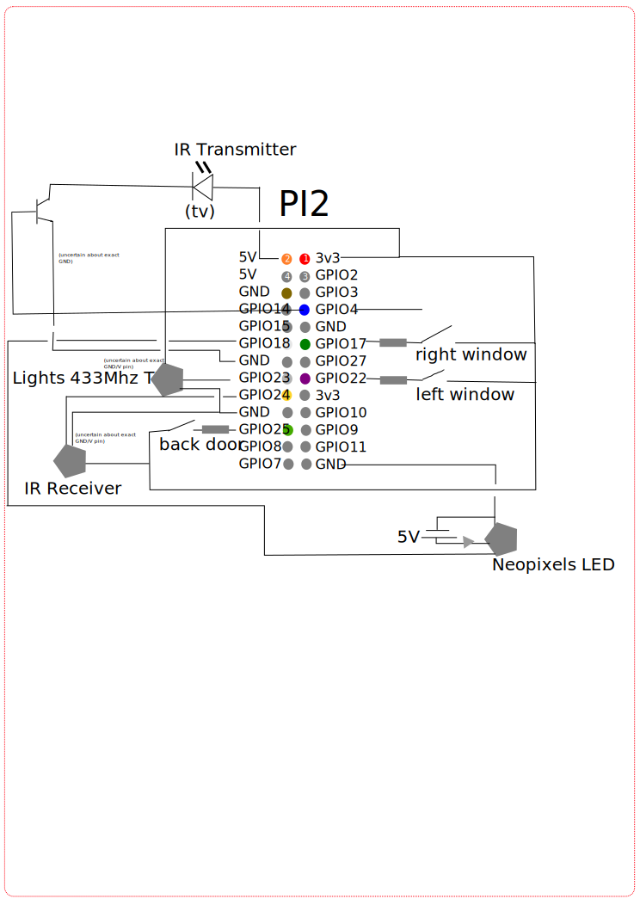
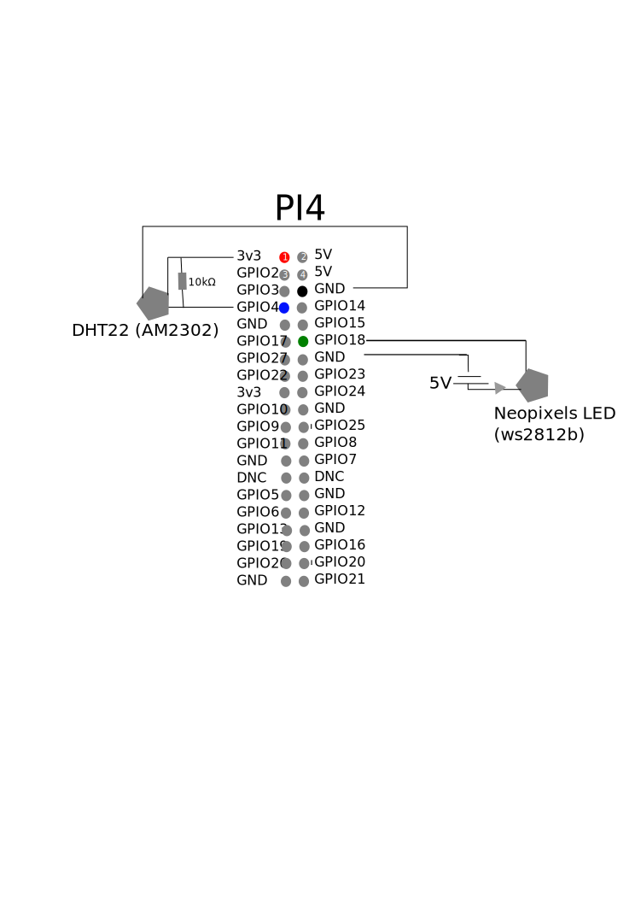

# Lighthome - Lightweight Home Automation

This repository contains part of my home automation configuration.

## Introduction

Though I'm using [Home Assistant](https://home-assistant.io) on the central
server at the heart of my home automation ([configuration
here](https://github.com/proycon/homeassistant-config)), I have various
Raspberry Pis and other devices that are an integral part my home
automation system.

To keep things on the various devices as lightweight and as portable as
possible, I wrote 'lighthome'. It consists of various shell scripts and some
simple programs to read/write several sensors. Central in the communication
between all devices is the MQTT broker.

## Architecture

* `scripts/common/include.sh` - Defines common functions, including:
    * ``mqtt_receiver *[handlers]*`` - Subscribes to MQTT and registers one or more handler scripts, takes care of reconnect logic in case of failures, parallelisation, and runs asynchronously
    * ``mqtt_transmitter *[topic] [interval] [sender]* `` - Takes input and publishes it on MQTT, takes care of reconnect logic in case of failures, parallelisation, and runs asynchronously
    * ``mqttpub *[topic]* *[payload]*``- Publish a single MQTT message
* **handler scripts** (``scripts/mqtthandlers/*``) - Receives MQTT stream on standard input and should invoke scripts that perform the action by calling an action script. 
    * These scripts are sourced and everything inside should be run asynchronously!
    * The script doesn't have to deal with MQTT itself, except if it wants to publish feedback (using ``mqttpub``)
* **sender scripts** (``scripts/mqttsenders/*``) - Monitors some device/sensor (preferably via an independent action script or program) and then translates its output for MQTT (standard output) 
    * These scripts are run normally, either over and over at a specified interval or as a one-shot script that runs indefinitely by itself.
    * Standard output serves as payload for MQTT (the script doesn't have to deal with MQTT itself)
* **actions scripts and programs** (``scripts/``, ``programs/``) - Perform any action, completely MQTT unaware, can also be invoked independently from command line for low-level testing
* `setup-raspberry-pi.sh` - Script to setup raspberry pi. For headless setup, first `sudo touch /boot/ssh` on the image, and add a `/boot/userconf.txt` with contents `homeautomation:$encryptedpw` where the password is encrypted with `openssl passwd -6`.
    

I decided on simple shell scripts to act as the glue between components and not
opt for another layer in for example Python. In true UNIX-fashion each tool
should have a well defined task, be efficient, communicate over standard input
and output, and not add any unnecessary complexity. I also tried to separate
the MQTT-logic from the logic addressing various sensors, so the latter can also be used independently.

The actual communication with MQTT is done via the excellent
[mosquitto](https://mosquitto.org/) CLI clients (`mosquitto_sub` and
`mosquitto_pub`) communicating with the mosquitto daemon running on the main server.

## Devices

### Raspberry Pi 1  (RaspiOS)

* GPIO: 433.92Mhz Transmitter for lights (see also https://github.com/proycon/433mhzforrpi/)
* GPIO: Door/doorbell sensors (wired, reed contacts)
* GPIO: IR LED for remote control of TV/audio

### Raspberry Pi 2 (RaspiOS) 

* GPIO: 433.92Mhz Transmitter for lights
* GPIO: Door/window sensors (wired, reed contacts)
* GPIO: Neopixels LED (WS2812B) for ambilight in living room
* GPIO: IR LED for remote control of TV/audio
* GPIO: IR Receiver
* USB: [RFLink Transceiver](http://www.rflink.nl/), 433.92Mhz, based on Arduino Mega

### Raspberry Pi 3 (RaspiOS)

* GPIO: [DHT-22 temperature/humidity sensor](https://www.adafruit.com/product/385)
* GPIO: Neopixels LED (WS2912B) fireplace ([video](https://www.youtube.com/watch?v=i18eXQIXzXg))
* GPIO: [PIR sensor](https://www.adafruit.com/product/189)
* GPIO: [MH-Z19 CO2 sensor](https://www.tinytronics.nl/shop/nl/winsen-mh-z19b-co2-sensor-met-kabel')
* USB: [RFLink Transceiver](http://www.rflink.nl/), 868.3Mhz, based on Arduino Mega

### Raspberry Pi 4 (RaspiOS)

* GPIO: Neopixels LED (WS2912B)

## History

Initially I ran Home Assistant on these devices as well, but due to their
decision to remove GPIO support and the increased amount of unnecessary bloat
which I don't need, I desired to go for a more lightweight approach and just
write things from scratch.

